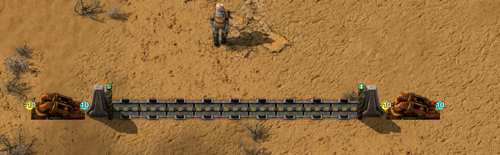

```markdown
# Implementation Plan: Pressurized Pneumatic Gates

Pressurized gates function as interactive, walkable pedestrian crosswalks across pneumatic tube lines, replacing generic underground tubes. Pressure, sensing range, and capsules travel through the beam of the gate along its primary axis, while players walk across perpendicular.

### Core Airlock State Mechanics
* **Gate Closed (Up):** The conduit is sealed. Transmits full pressure (`pressure_transmit = true`), allows capsule transit (`capsule_transmit = true`), and transmits counter sensing range (`sense_transmit = true`).
* **Gate Lowered / Open (Down):** The pneumatic seal is broken. **Cuts pressure immediately** (`pressure_transmit = false`), causing pressure across the gate to vent/drop to 0 and holding incoming capsules. **Does NOT cut sensing** (`sense_transmit = true`), preserving Capsule Counter territory and network monitoring without blind spots.
* **Lazy Discovery:** Vanilla gates across the map consume 0 bytes of Lua memory until physically contacted by active pneumatic equipment.

---

### Task 1: Research Prototype & Dynamic Port Definitions

**Scope:** Add the research unlock and define cardinal port specifications for vanilla `gate` and `wall` entities supporting dynamic seal states.

* **Files to Modify:**
  * `prototypes/technology.lua`
  * `scripts/flow/port-defs.lua`

* **Implementation Steps:**
  1. **Technology Prototype (`prototypes/technology.lua`):**
     * Register `pressurized-gates` technology node.
     * Prerequisites: `pneumatic-transport`, `gate`.
     * Unit cost: 100 packs @ 30s (`automation-science-pack`, `logistic-science-pack`).
     * Order string: `c-a[pressurized-gates]`.
  2. **Gate Port Layout (`scripts/flow/port-defs.lua`):**
     * Register vanilla `gate` in port definitions with axis-locked ports:
       * Horizontal gate: East `(0.5, 0)` and West `(-0.5, 0)`.
       * Vertical gate: North `(0, -0.5)` and South `(0, 0.5)`.
       * Base transmission flags: `capsule_transmit = true`, `pressure_transmit = true`, `sense_transmit = true`.
     * Support dynamic state inspection: Expose a helper/flag to evaluate `pressure_transmit = gate.is_closed()` while keeping `sense_transmit = true` unconditionally.
  3. **Wall Passthrough Collar (`scripts/flow/port-defs.lua`):**
     * Register vanilla `wall` with inline 2-port passthrough matching the incoming axis (East/West or North/South) with static flags: `capsule_transmit = true`, `pressure_transmit = true`, `sense_transmit = true`.

* **Acceptance Criteria:**
  * `pressurized-gates` appears in the research tree with correct prerequisites.
  * `port_defs.get_ports(entity)` returns valid axis-aligned ports for horizontal and vertical gates and walls.
  * Port definitions keep `sense_transmit = true` independently of gate physical elevation.

---

### Task 2: Lazy Boundary Assimilation, Raycast & Seal State Monitoring

**Scope:** Implement on-demand discovery, corridor validation, graph linking, severance pruning, and active gate open/close pressure cutting in `flow-engine.lua`.

* **Files to Modify:**
  * `scripts/flow/flow-engine.lua`

* **Implementation Steps:**
  1. **Boundary Discovery Check:**
     * When an active pneumatic entity (`pneumatic-tube`, `pneumatic-pump`, `junction`) checks an adjacent tile:
     * If no node exists in `storage.flow_grid`, verify `force.technologies["pressurized-gates"].researched == true`.
     * If researched and the target tile contains a `gate` (or `wall`), initiate corridor raycast.
  2. **Corridor Raycast Validation:**
     * Lock coordinate axis (Horizontal = fixed $Y$, step $X$; Vertical = fixed $X$, step $Y$).
     * Enforce at most 1 wall tile at corridor start and at most 1 wall tile at corridor end. Halt and reject if $\ge 2$ consecutive wall tiles are encountered.
     * Reject if any tile contains a perpendicular gate, an offset/staggered gate, or an empty tile.
     * Accept corridor if the ray terminates at an active pneumatic port (`pneumatic-tube`, `pneumatic-pump`, or `junction`).
  3. **Graph Assimilation & Tracking:**
     * For all verified gate and collar wall tiles in the corridor:
       * Instantiate entries in `storage.flow_nodes` and `storage.flow_grid`.
       * Create bidirectional connection edges in `storage.flow_connections`.
       * Track assimilated gate entities in `storage.active_gates[unit_number] = { entity = gate, node_keys = { ... }, was_closed = gate.is_closed() }`.
       * Enqueue boundary ports into `storage.flow_queue` (and `storage.counter_queue`) to initiate wavefront propagation.
  4. **Dynamic Seal State Polling (Pressure Cutting):**
     * In the flow engine tick step (or throttled gate monitor):
       * Iterate active assimilated gates in `storage.active_gates`.
       * Check `gate.is_closed()`.
       * **If transitioning Closed -> Open (Lowering):** Set `node.pressure_transmit = false` and `node.capsule_transmit = false` on the gate's flow nodes. Keep `node.sense_transmit = true`. Enqueue neighbor ports into `storage.flow_queue` to drain pressure across the open crosswalk.
       * **If transitioning Open -> Closed (Rising):** Restore `node.pressure_transmit = true` and `node.capsule_transmit = true`. Enqueue ports into `storage.flow_queue` to restore pressure and wake parked capsules.
  5. **Corridor Pruning & De-assimilation:**
     * On entity deconstruction/destruction of any gate, collar wall, or attached pneumatic component:
       * Remove nodes from `storage.flow_nodes`, `storage.flow_grid`, and `storage.active_gates`.
       * Sever connections, trigger recession waves, and revert unaffected gate entities to untracked vanilla status.

* **Acceptance Criteria:**
  * Straight gate lines between two pumps become pressurized (+10 / -10) when the gate is closed.
  * Walking up to the gate causes it to open, **immediately cutting pressure** across the corridor while Alt-Mode sensing indicators remain active.
  * Walking away allows the gate to close, re-establishing the seal and restoring full pressure.
  * Staggered/offset gates and 90° gate elbows remain unpressurized.
  * Unconnected perimeter wall gates consume zero Lua memory.

---

### Task 3: Capsule Transit Physics, Queue Parking & Flow Rendering

**Scope:** Ensure capsules park safely when the gate opens and resume motion immediately when the gate closes, with clean Alt-Mode rendering.

* **Files to Modify:**
  * `scripts/capsules/capsule-runner.lua`
  * `scripts/flow/flow-engine.lua`

* **Implementation Steps:**
  1. **Pressure-Governed Capsule Parking (`scripts/capsules/capsule-runner.lua`):**
     * Because the gate cuts pressure when lowered (`pressure_transmit = false`), incoming capsules encounter zero pressure gradient (`drop <= 0`) and naturally park at the approaching tube/gatepost node.
     * Ensure `capsule_runner.wake_parked_capsules` triggers when the gate re-closes and pressure restores, advancing queued capsules across the crosswalk.
  2. **Mid-Transit Gate Lowering Safety:**
     * If a gate begins lowering while a capsule is already occupying a gate node:
       * The capsule completes its current hop safely into the next node or parks in place until the gate closes, preventing item loss or entity crashes.
  3. **Passenger Transit Sync:**
     * Verify that player-occupied capsules (`player-transit-capsule`) handle gate transitions smoothly without hitching.
  4. **Alt-Mode Flow Vector Polish (`scripts/flow/flow-engine.lua`):**
     * Render active pressure connection vectors when the gate is closed.
     * When the gate opens and pressure drops, clear pressure vectors across the gate opening while keeping Capsule Counter sensing indicators visible.

* **Acceptance Criteria:**
  * Capsules travel through a closed pressurized gate without interruption.
  * Opening the gate while a capsule approaches causes the capsule to stop and park at the threshold.
  * Closing the gate restores pressure and immediately wakes the parked capsule to complete its crossing.
  * Alt-Mode reflects live pressure cut/restore states while sensing range remains unbroken.
```