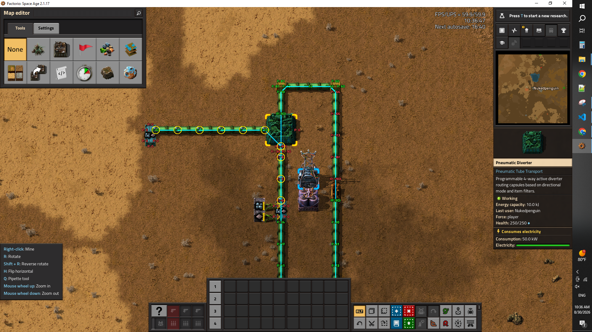
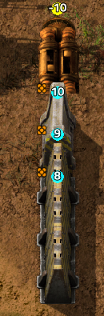

(~ = marked as completed)

~make bio capsules minimum cargo increase by 1 to prevent instant packing when there is no cargo

~make the liminal item holder's cargohold larger or dynamic to account for larger capsule capacities

~make the spilled capsule container able to hold variable sized contents, and not be an exploit of free insertable cargo space after spill. (can take out but not put things in)

~make the spilled capsule container go away when empty (like player bodies after looting, or crashed cargo capsules in space age do)

~prime the liminal holder entity spawning to be spaced out on a grid. storing spaces free for reuse later. (this is to account for when units spawn from spoiling items, we can know what liminal holder by proximity, so there needs to be decent spacing between liminal holder cells)

~make liminal item holder selectable for debugging since players wont be on the surface to see them anyway.

~make units spawned from spoilables while on the liminal surface of the liminal item holder, make those units spill out like spilled cargo items would (this doesnt mean crash the capsule, just spawn/move the units to where the capsule is in the real world like we do when it triggers spill)

~investigate why stalled capsules impact fps so greatly even in low quantities (a stalled capsule is one that isnt moving through the network, just parked, waiting for a spot)

~add capsule peeking feature /capsule-peek lets you hover your mouse over a pneumatic entity and it will render capsules in any internal networks of this entity that are occupying this entity (so if its a merged network, you only see capsules on the tube you're hovering over) toggles off the capsule-debug for that player as they are mutually exclusive but can also be both off at the same time. (both only render during alt mode)

~fix small flow update bug in light of the recent stage 4 fix of the performance plan involving short circuiting checks (state changes in pump and hubs dont wake up the network or capsules, such as enable on pump or toggle on receive capsules), I believe it has to do with caching.

~do the same wakeup update for diverters as done previously with hubs and pumps

~further fix the stale pump status in certain situations (like flipping the pump and toggling enable/disable didnt update the flow of the network, and flipping it back and toggling enable disable didnt update it either, as if flipping/rortating the pump caused the flow updates from enable/disable to be ineffective even though initially enable/disable was effective prior to messing with pump flip/rotation). I believe this also affect diverters the same way.

~fix flow rendering flag from not updating properly (seems tied to reflow), notably /toggle-flow states dont refresh when using the command unless forcing an update on a network segment by way of interaction

~investigate this line from capsule lifecyle and its implications: local current_durability = stack.durability or 1000

~fix diverters from backing up if there's an open route

explore ways to make capsule movement much more performant (right now it's extremely laggy with only 150 moving capsules, down to 30 ups!)

investigate why recently packed capsules dispatching from hubs are prioritizing moving into a higher pressure (eg moving into -34 instead of -66) 

improve deconstruction/removal of pnuematic networks (particularly regarding merge type networks). consider a staged, progressive over time rebuild of networks rather than that instant.

fix deleting pumps with the decon tool in sandbox would leave behind the circuit proxy (check if this is the same case for diverters)

mark capsules that dont have spoilage to not be re-poll candidates for dominant item rechecks

clean up command naming, explore adding in some toggles in the hotbar toggles section (vertical elipsis button)

make it force player hand inserted items back into their hand when they try to exploit spilled capsule containers as extra storage