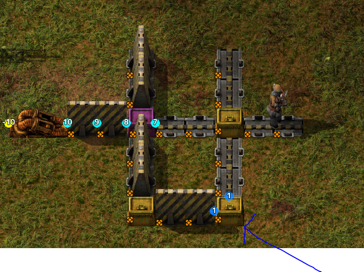

(~ = marked as completed)

~include pipette copying of hub, pump, and diverter settings 

~add directional icons for the diverter gui to help mental fatigue

~make hub, pump, and diverter settings blueprintable (as in the bp metadata is incorporate in the bp)

~consider rending order (like making flow under capsule render) (discovered render circle doesnt have fine control over render layer)

~include visible filters over diverter ports when there are some

~make circuit proxys included in blueprints (linked to their device in bp metadata so when placement occurs we dont create a duplicate proxy)

~fix the situation where you would set an item filter in diverter when you already had a comparator and quality set, would clear the comparator/quality

~fix the situaton where pasting a bp would sometimes link circuit wires between diverters or pumps you just pasted down with a blueprint nearby

~add a copy/paste port settings feature for the diverter (a little button pair somewhere on each diverter port gui module)

~consider reverting back to having the diverter's 'all' mode selected by default when opening the gui

~make it so pressing esc cancels the item with quality and comparator gui rather than submitting into the diverter slot

~fix when clicking pneumpatic pump it doesnt open its gui

~fix that setting a quality in the diverter's item with quality comparator gui, and an item, but then clearing the item, and pressing submit, would ghost keep the quality until changing the comparator or item or quality

~make sure to update en locale to include recharge refrigerated capsule

~address why rotating pumps flow dot layering is inconsistent when rotating (same with diverter), when normally it would show 9 in front but after rotation the 10 is prioritized. the goal is to be consistent rather than 'doing the right thing'

~consider adding a nest capsules toggle on hubs (on by default), which means hubs can attempt packing capsules, not that its prioritized in any order, just to make it easier to manage hubs where you want extra capsules in the hub for sending with but not trigger packing of capsules within capsules if you dont want. it can be done currently via circuit networks but i think a toggle for nest capsules would feel really nice to have.
example scenario provided in image: where you'd want extra capsules for sending circuits or managing excess capsules by having a circuit toggle the enables nest capsules... in that case im starting to think it should be a binary feature, nest capsules on would mean hub can only pack capsules with capsules, and nest capsules off means you can only pack non capsule cargo 

~ensure proper buildings make the correct capsule recipes, and they are located in the correct tabs (recharge spent refrigerated capsule is in the misc tab now, should be moved with the others, into pneumatic transport tab)

~include capsule details in factoriopedia (like if it supports mixed cargo)

~make copy settings more native feeling for diverters and pumps (sound and yellow and green hover target outline); essentially copying/pasting settings relies on the source entity to remain alive

~~investigate the inconsistent manner of which pneumatic entities trigger their copy/paste settings (are hubs treated too special since their prototype allows native copy/paste events? or is this a necessary evil?)

~fix en locale for all recipes that do not have an entry

~consider removing pneumatic entity setting adoption of ghosts when placing over entity which would be a different bounding box shape or orientation. inother words, if the entity placed on the ghost isnt square on it dont adopt the settings from the ghost. (however, rotations and flips are fair game to adopt settings if they dont violate this principle)

~consider adding capsule counter entity (1x2, uses power, reads how many capsules are currently in a tube segment. it emits a signal, all the capsules' primary capsule type and quality, can select which wire color to output on, red or green), determine if we need a circuit proxy for this entity, and what kind it has to be.

~make nest capsules off by default

~ensure all technology has an en locale so 'unknown key' doesnt keep appearing

~remove any mention of the old v1 engine in the project

~make a capsule counter research that require the circuit network tech and the initial pneumatic tech, in order to be able to craft capsule counters

~add vacuum capsule unlocked with space tech, same stats as standard capsule, but with added vaccuum ability, which takes items off any belt segment that is touching a hub port (works on undergound belts and belts, any quality). this makes the hub fill up without needing inserters

~make reinforced capsule's role more distinct, enforce strict bulk transport, all same item type, same quality, must use all slots to pack (dont forget to update descs)

~add a new capsule type unlocked on fulgora, designed to be the true mixer, zero restrictions on packing, can be any items, any quantity, any quality, (so you could load 1 single copper cable and be packed, or 23 rare iron gears, plus 27 uncommon LDS, plus 100 normal stone bricks), begins with 2 base slot capacity.
crafted using 75 superconductor 2 LDS and 25 scrap. dont forget all tech and locale, item descs, balance. do not have overly wordy descs.

~~add ladder for going over pneumatic tubes with character~~

~do not turn of transmit sense at terminator gates when opening the gate

~add a pre-emptive soft registry of walls/gates that are built next to a pneumatic port with active flow, so that we can enqueue an efficient flow queue wake up when the interoperability tech finishes being researched

~add a pneumatic gate which lets capsules through when closed

~fix that in certain scenarios with deleting and rotating gates and placing them back and rotating would not wake up the flow properly

~fix that building over a pneumatic entity to upgrade quality, would not preserve the original settings when building out of inventory

~add player equipment: electromagnetic harness that lets you launch from EM projectors while in a player transit capsule

--------------------------------------------

consider breaking apart large files that are doing too many things (like flow-engine)

fix the recipe for the refrigerated capsule (so recharging coolant isnt lossy)

fix pasted ghosts do not show the correct settings reflected in their gui when clicked. (though, it does once the real building is placed)

fix diverter circuit proxy disappearing after placing a real one on a diverter ghost

